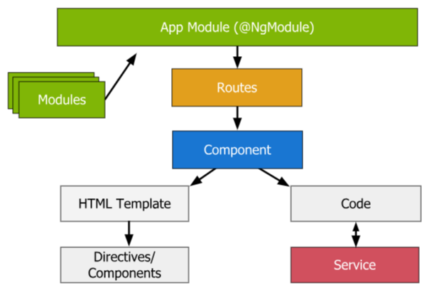
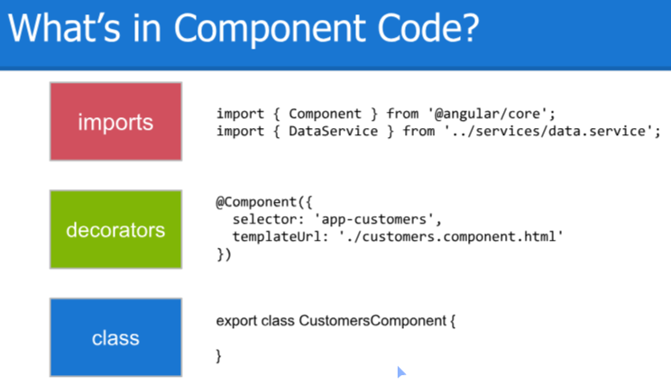

[Docs](<https://angular.io/guide/architecture>)

# Arquitectura

Angular es una plataforma y framework para construir aplicaciones en **HTML** y **TypeScript**. Por defecto, implementa funcionalidades core y librerías adicionales que se pueden importar a la hora de realizar las aplicaciones.

Los bloques básicos de construcción de una aplicación son los **Módulos**. 

## Módulos

```
@NgModule
```

Un módulo dispone de un **contexto para sus componentes,** recogen código relacionado. Para definir un módulo, debemos utilizar la siguiente estructura de declaración:

```js
import { NgModule } from '@angular/core';

@NgModule({
  imports: [ ... ],
  declarations: [ ... ],
  bootstrap: [ ... ]
})
export class AppModule { }
```

Cualquier aplicación tendrá como mínimo un módulo root (`app.module.ts`) que permite arrancar la aplicación, y normalmente contará también con módulos que implementan más funcionalidades.



## Componentes

```js
@Component
```

Un componente define una clase y contiene la lógica y datos de una parte de la aplicación. También está asociada con un HTML que define su vista.



Como podemos ver tiene tres partes principales:

1. **Imports**: cada una de las piezas que necesitamos para que el componente funcione. Se declaran al principio.
2. **Decorator**: el selector por el cual nos vamos a referir a este componente, su layout y sus estilos.
3. **Class**: las funcionalidades que contiene el componente.

La estructura de cualquier componente es:

```js
// Ejemplo componente USER
user
├──	user.component.css // Estilo de la vista
├──	user.component.html // Vista
├──	user.component.ts // Lógica
└──	user.component.spec.ts // Tests
```

Una aplicación cuenta como mínimo con un componente root (`app.component.ts`) que genera una jerarquía de los demás componentes con el DOM.

La declaración básica del archivo de lógica en un componente cumple con la siguiente estructura:

```js
import { Component } from '@angular/core';

@Component({
  selector: 'app-hero',
  templateUrl: './hero.component.html',
  StyleUrls: ['./hero.component.css']
})
export class HeroComponent {
  name: string;

  constructor() {
    this.name = 'Hercules';
  }
}
```

### Template

Las plantillas combinan HTML con markup propio de Angular que pueden modificar esos elementos HTML.

Las **directivas** engloban la lógica del componente, y gracias al **binding markup** podemos conectar esa lógica con la vista.

Existen dos tipos de data binding:

- Event binding: permite respoder ante una acción realizada por el usuario.

- Property binding: permite interpolar valores obtenido desde los datos de la aplicación en el HTML. 

#### Pipes
[Docs](<https://angular.io/guide/pipes>)

Los pipes modifican la forma en la que se muestran los datos en la vista. Permiten por ejemplo formatear fechas de forma sencilla.

```js
// Valor de la variable
birthday = new Date(1988, 3, 15); // April 15, 1988

// Distintos formatos
{{ birthday | date:"dd/MM/yy" }} // 15/03/1988 - Español
{{ birthday | date:shortDate }}	// 3/15/1988 - Americano
{{ birthday | date:fullDate }} // Friday, April 15, 1988 - Americano

// Permiten también concatenar distintos pipes
{{ birthday | date:fullDate | uppercase }} // FRIDAY, APRIL 15, 1988
```

## Servicios

```js
@Injectable
```

Si queremos utilizar **datos o lógica que no estén asociados a un módulo** únicamente, podemos generar un servicio.

La estructura básica de un servicio es la siguiente:

```js
import { Injectable } from '@angular/core';

@Injectable()
export class HeroService {    
    constructor(...){
        ...
    }
}
```

Al declarar una clase como `@Injectable` estamos declarando que esa clase puede ser inyectada en los demás módulos como una dependencia.

Gracias a la **Dependency injection (DI)** podemos mantener limpias y eficientes nuestras clases.

==Las clases no recogen datos, validan o registran en la consola directamente. Delegan estas tareas en los servicios.==

## Rutas

El módulo `Router` mapea las distintas rutas de la aplicación. Una aplicación cuenta como mínimo con un `Router`, aunque **cada módulo puede incorporar sus propias rutas**.

El Router por defecto de la aplicación se encuentra en `/src/app/app-routing.module.ts`.


[Más información sobre Rutas](Rutas/Inicio.md)