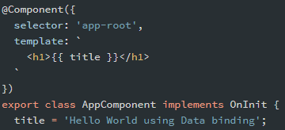
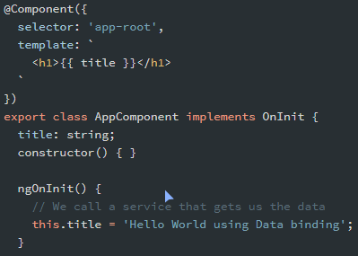

# Data binding

Si queremos **enviar una variable a la vista** para mostrarla, podemos declararla dentro de un componente.

```typescript
// Dentro del bloque OnInit
nombre = 'Ciro';
```

Ahora, mediante **interpolation** (interpolación) desde la vista podemos mostrar el contenido de dicha variable de la siguiente manera:

```typescript
{{ nombre }}
```

**Ejemplo simple:**



**Ejemplo avanzado:**

