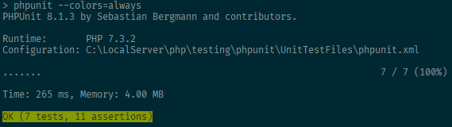
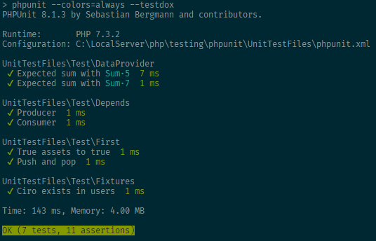

# Setup

[Documentation](<https://phpunit.readthedocs.io/en/8.1/installation.html>)

PHPUnit 8.1 requiere PHP 7.2.

## Instalación mediante Composer

La forma más sencilla de instalar PHPUnit es mediante su package para Composer.

Para incluirlo, simplemente añadimos una dependencia para el entorno de desarrollo.

```bash
composer require --dev phpunit/phpunit ^8.0
```

Una vez añadida, la instalamos:

```
composer install
```

Ahora, creamos el script para ejecutar PHPUnit desde la carpeta vendor del proyecto.

```json
"scripts": {
	"tests": "phpunit --colors=always"
}
```

Cuando ejecutemos este comando desde composer mediante `composer tests`, nos aparecerá en consola el resultado de los tests que hayamos configurado de la siguiente forma:



## Argumentos opcionales

Podemos indicar argumentos que facilitan la lectura del resultado de los tests.

```json
"scripts": {
	"tests": "phpunit --colors=always --verbose --testdox"
}
```
El argumento `--testdox` transforma el nombre de los tests a una referencia mucho más descriptiva.

Convierte por ejemplo un test llamado `testPushAndPop` a `Push and pop`.

Convierte nombres escritos en camelCase o en snake_case.


El argumento `--verbose` hace que podamos ver toda la información disponible sobre los tests fallidos.

Estos comandos nos mostrará un resultado mucho más visual:



### --debug

Muestra información adicional sobre el orden en el que ejecuta los tests. Indica el inicio y final de cada uno.