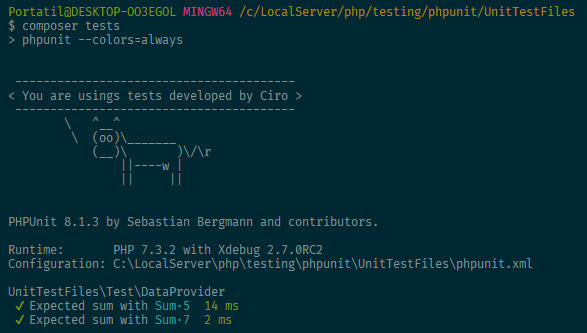

# Archivo de configuración

Podemos crear un archivo `phpunit.xml` en la raíz del proyecto con la configuración general.

```xml
<?xml version="1.0" encoding="UTF-8"?>
<phpunit
         bootstrap="vendor/autoload.php"
         colors="true"
         verbose="true"
         stopOnFailure="false">
    <testsuites>
        <testsuite name="Application Test Suite">
            <directory>./tests/</directory>
        </testsuite>
    </testsuites>
</phpunit>
```

Dentro de este mismo archivo, podemos indicar el argumento `--testdox` como una opción de phpunit.

```xml
<phpunit
         testdox="true"
         ...
```

## Logs

Dentro del archivo de configuración `phpunit.xml` podemos indicar si queremos que se almacene un registro de los tests que realizamos.

```xml
<logging>    
	<log type="testdox-text" target="logs/testdox.txt"/>
</logging>
```

El archivo que se genera será parecido a:

```
Proyecto\tests\Exception
 [ ] Exception

Proyecto\tests\First
 [x] True assets to true
 [x] Push and pop

Proyecto\tests\Fixtures
 [ ] Fixture is empty
```

## Generar archivo de % de cobertura del código

Mediante el argumento `--coverage-html` y **Xdebug** podemos generar un archivo (o web) con información sobre qué porcentaje de código de nuestra aplicación está cubierto en tests.

Para ello, aplicamos el argumento seguido de la ruta donde queremos generar el archivo.

```bash
--coverage-html ./tests/coverage
```

Para indicar sobre que código debemos realizar el informe, dentro del archivo `phpunit.xml` indicamos lo siguiente:

```xml
<filter>
    <whitelist>
        <directory suffix=".php">src/</directory>
        <directory suffix=".php">plugins/*/src/</directory>
        <exclude>
            <file>src/Console/Installer.php</file>
        </exclude>
    </whitelist>
</filter>
```

En este ejemplo, los directorios `src/` y `plugins/*/src/ ` entran dentro del informe, y el archivo `src/Console/Installer.php` se excluye del informe.

## Print

Podemos imprimir cierta información a la hora de ejecutar los tests.

Para ello, dentro del archivo de configuración, indicamos la opción:

```xml
printerFile="print.php"
```

Ahora, si generamos un archivo `printer.php`, podemos escribir código `php` y aparecerá como mensaje antes de los tests.

```php
// print.php
<?php
echo "\r\n";
echo " ----------------------------------------\r\n";
echo "< You are usings tests developed by Ciro >\r\n";
echo " ----------------------------------------\r\n";
echo "        \   ^__^\r\n";
echo "         \  (oo)\_______\r\n";
echo "            (__)\       )\/\\r\n";
echo "                ||----w |\r\n";
echo "                ||     ||\r\n";
echo "\r\n";
```

