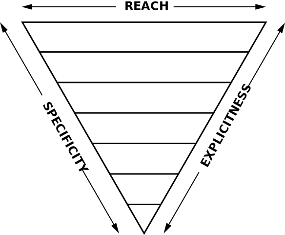

# Estructura

ITCSS (Inverted Triangle CSS) es una metodología que pretende organizar la estructura CSS de un proyecto en diferentes capas con ciertos niveles de especificidad, explicidad y alcance definidos.

Su objetivo principal es el de ofrecer una arquitectura fácilmente escalable, controlando en todo momento el resultado generado por nuestra hoja de estilos.

Una de las principales desventajas de las hojas CSS es que las reglas se aplican en cascada de arriba hacia abajo, esto es, si definidos ciertas reglas para un mismo elemento, prevalecerán las que se encuentren más cerca del final del documento.

## Capas

La arquitectura ITCSS nos permite **controlar el nivel donde queremos implementar una regla**, así como el alcance que va a tener.

1. **Settings**: variables, mapas.
2. **Tools**: mixins y funciones.
3. **Generic**: reset, normalize, animations.
4. **Elements**: selectores de elementos HTML. Body, Header...
5. **Objects**: selectores de objetos. Agrupan componentes.
6. **Components**: cada una de las piezas por separado. Selectores id y class.
7. **Pages**: Estilos específicos de páginas (contact page). *Opcional*.
8. **Utilities**: addons y complementos. Vendor stylesheets. *Opcional*.
9. **Trumps**: reglas que deben prevalecer sobre todas las demás. Hacks, Importants. *Opcional*.

Las primeras dos capas (Settings y Tools) no compilan código CSS, es a partir de la tercera (Generic) cuando empezamos a dibujar nuestra hoja de estilos. Las dos últimas capas son opcionales, ya que si no requerimos de Utilidades o de Trumps podemos evitarlas. Es recomendable no incluir mucho contenido en el último nivel, ya que por definición estaremos declarando reglas que sobreescriben otras.

## Jerarquía

Gracias a la estructura definida por ITCSS, se genera un triángulo de **especificidad, explicidad y alcance**. Cada nivel del triángulo aporta un valor superior o inferior sobre estos tres parámetros.

La definición de los parámetros es la siguiente:

1. Gran alcance a más localizado: cada selector debe tener un alcance superior al que definamos debajo.

2. Baja especificidad a alta especificidad: cada selector debe ser menos específico que el que definamos debajo.
3. Genérico a Explícito: cada selector debe ser más genérico que el que definamos debajo.

